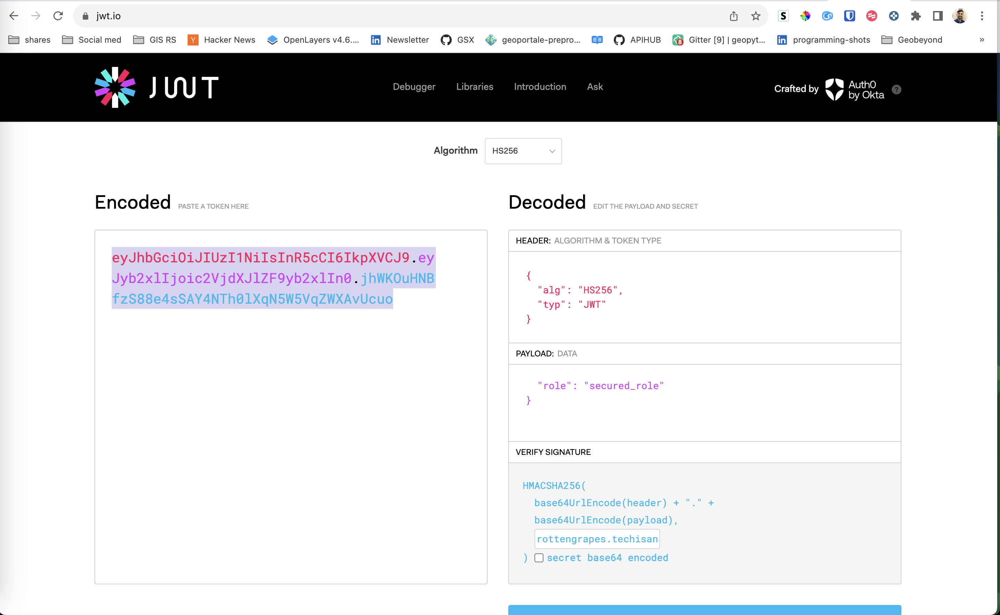
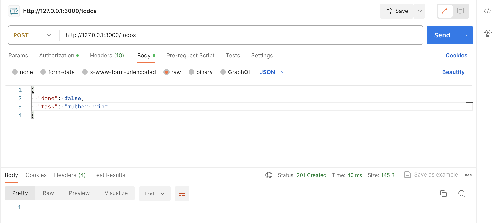

# Setting up Postgresql for talk

To move forward, you can either start setup as per `docker-compose.yml` file *or* make sure you have following things
1. PostgreSQL - PostGIS 
2. Download PostgREST setup
3. Have swagger API Hub


Once the **Database** is up and running we can do following setup
- Create a *Anonymous* user 
  
This will be used as go to user for all APIs when no other authentication is provided

Here is the code for it 

```
create role web_anon nologin;

grant usage on schema fresh to web_anon;

create table todos (
  id serial primary key,
  done boolean not null default false,
  task text not null,
  due timestamptz
);

insert into todos (task) values
  ('finish tutorial 0'), ('pat self on back');


grant select on fresh.todos to web_anon;
```

Once you add new layer, you'll need to give *select* access to the role *web_anon*, 

```
grant select on fresh.port to web_anon;
```

After this we need to restart the `postgrest` service to display APIs in swagger doc.


- Create a *Secured* user 
  
This will be used as  authentication to allow `POST,PATCH,DELETE` on the tables

```
create role secured_user noinherit login password 'secured_user';

create role secured_role nologin;
grant secured_role to secured_user;

grant usage on schema fresh to secured_role;
grant all on fresh.todos to secured_role;
grant usage, select on sequence fresh.todos_id_seq to secured_role;
```

Once the user and role is created, next task is to pass this as authentication. To do this we can use [jwt.io](https://jwt.io)

to create a JWT token we need to put a long difficult 32 char long string as a [JWT-SECRET](https://postgrest.org/en/stable/references/configuration.html?highlight=environment#jwt-secret)

In our case
1. jwt-secret = 'rottengrapes.techisanopensourcecompany@438'
2. role = 'secured_role'



Once token is created, you can use it for `POST,PATCH,DELETE` calls




