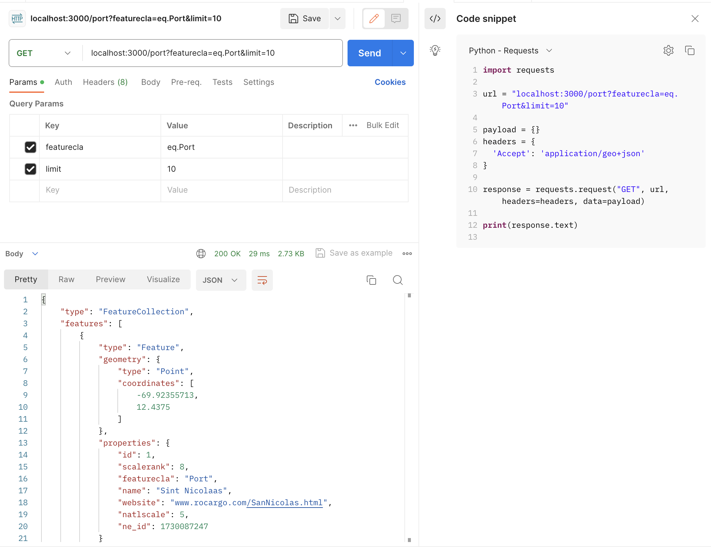
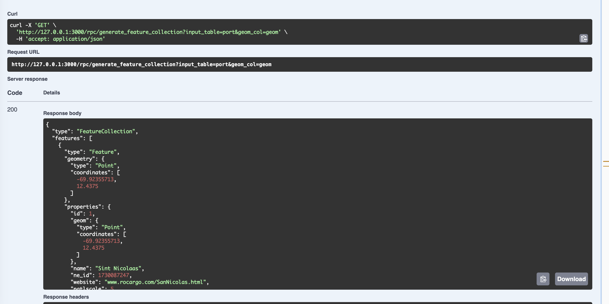
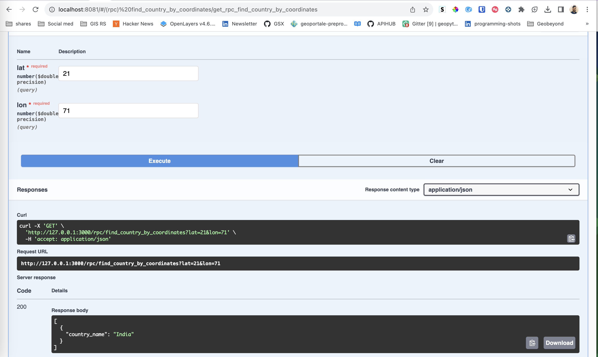

# Using PostGIS functions in PostgREST

## Get data back as Geojson

In normal query send header as 
`Accept: application/geo+json`

this will change result to *GeoJSON*


## Using existing postgis functions

all functions are accessible as functions which can be used with *rpc*

- ST_Intersect
```
http://127.0.0.1:3000/rpc/_st_intersects?geom1=POINT(1 1)&geom2=POLYGON ((0 0, 2 0, 2 2, 0 2, 0 0 ))
```

- ST_Transform

```
http://127.0.0.1:3000/rpc/st_transform?geom=POINT(1 1)&from_proj=EPSG:4326&to_proj=EPSG:3857
```

## Creating custom functions for your own requirement 

### Get table data as Geojson

```
CREATE OR REPLACE FUNCTION generate_feature_collection(input_table text, geom_col text)
RETURNS jsonb AS $$
DECLARE
    result jsonb;
BEGIN
    EXECUTE '
        SELECT jsonb_build_object(
            ''type'',     ''FeatureCollection'',
            ''features'', jsonb_agg(features.feature)
        )
        FROM (
            SELECT jsonb_build_object(
                ''type'',       ''Feature'',
                ''geometry'',   ST_AsGeoJSON(' || quote_ident(geom_col) || ')::jsonb,
                ''properties'', to_jsonb(inputs) - ' || quote_ident(geom_col) || '
            ) AS feature
            FROM (SELECT * FROM ' || quote_ident(input_table) || ') inputs
        ) features
    ' INTO result;
    
    RETURN result;
END;
$$ LANGUAGE plpgsql;
```

which then can be executed 

```
http://127.0.0.1:3000/rpc/generate_feature_collection?input_table=port&geom_col=geom
```



### Get country name based on lat lon passed

```
CREATE OR REPLACE FUNCTION find_country_by_coordinates(
    IN lat FLOAT,
    IN lon FLOAT
)
RETURNS TABLE (country_name VARCHAR)
AS $$
BEGIN
    RETURN QUERY
    SELECT name
    FROM countries
    WHERE ST_Within(ST_SetSRID(ST_MakePoint(lon, lat), 4326), geom);
END;
$$ LANGUAGE plpgsql;

```

which then can be executed 

```
http://127.0.0.1:3000/rpc/find_country_by_coordinates?lat=21&lon=71

```

